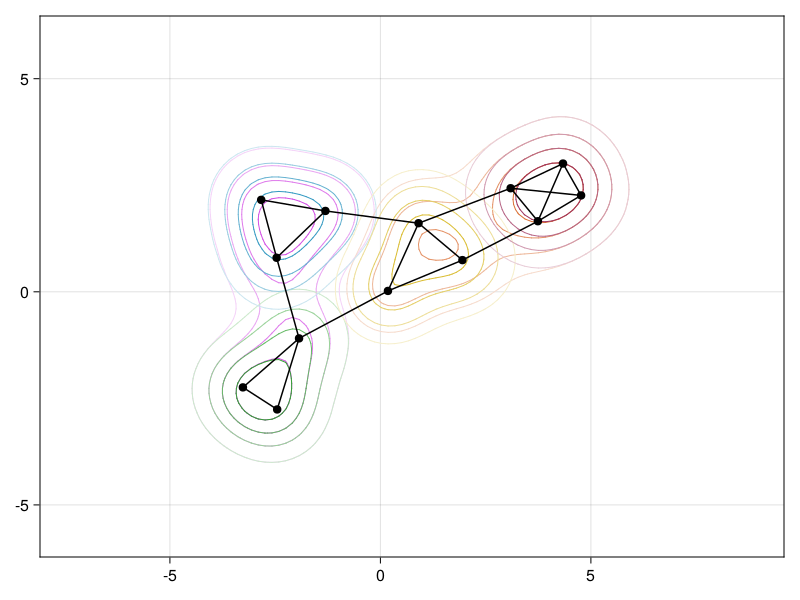

# NestedGraphMakie

A package for [NestedGraphs.jl](https://github.com/UniStuttgart-IKR/NestedGraphs.jl) to make easy visualizations.
See the [NestedGraphs.jl]() docs for some examples

This package exports `ngraphplot`, which provides some extra features on top of `GraphMakie.graphplot`.
All features of `GraphMakie.graphplot` can be accesssed whatsoever.

See the [API]() of `ngraphplot`

Some examples of `NestedGraph` visualizations:
```julia
using Graphs, NestedGraphs, NestedGraphsMakie, GLMakie
ngm = let
  g1 = complete_graph(3)
  g2 = complete_graph(3)
  g3 = complete_graph(3)
  g4 = complete_graph(4)
  eds = [((1,1), (2,1)), ((3,2), (2,1)), ((3,3),(2,3)), ((1,1),(4,1))]
  ng = NestedGraph([g1,g2,g3,g4], eds, both_ways=true)
  ng1 = NestedGraph([g1,g2], [((1,1), (2,1))])
  ng2 = NestedGraph([g3,g4], [((1,2), (2,2)), ((1,3), (2,3))])
  NestedGraph([ng1, ng2], [((1,1),(2,1)), ((1,5),(2,2))], both_ways=true)
end

ngraphplot(ngm)
```


It turns out it's quite hard to visualize all nested subgraphs.
Currently the following requires a rather heavy dependency.

```julia
ngraphplot(ngm, show_subgraph_regions=true)
```



```julia
mlg = let
  layer1 = complete_graph(4)
  layer2 = barabasi_albert(4, 3; seed=123)
  layer3 = SimpleGraph(3)
  add_edge!(layer3, 1,2)
  add_edge!(layer3, 2,3)

  mlg = NestedGraph([layer1, layer2, layer3])

  for v in 1:(nv(layer2)-1)
      add_edge!(mlg, NestedEdge(1,v, 2,v))
  end
  for v in 1:(nv(layer3)-1)
      add_edge!(mlg, NestedEdge(2,v, 3,v))
  end
  add_edge!(mlg, NestedEdge(1,4, 3,3))
  mlg
end

ngraphplot(mlg; multilayer=true, nlabels=repr.(mlg.vmap))
```

